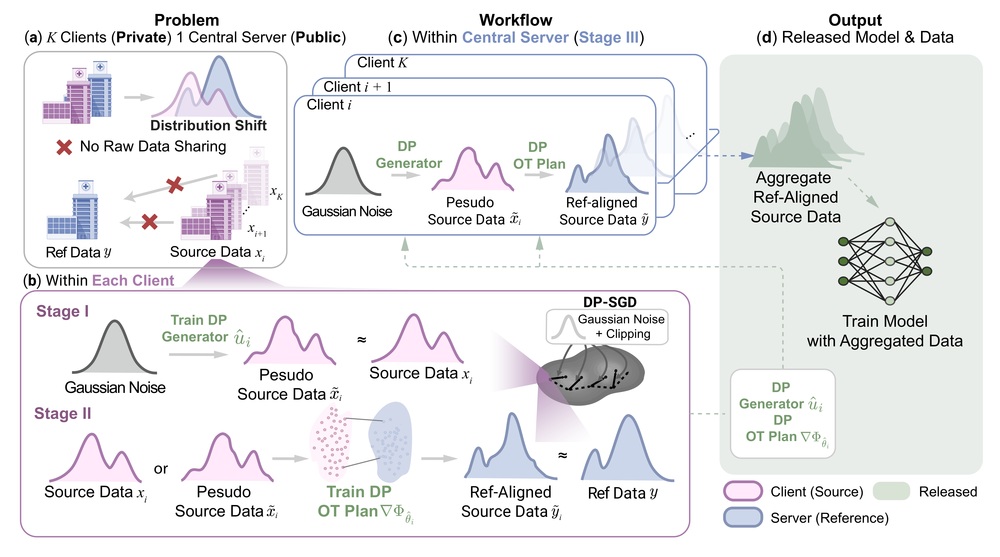
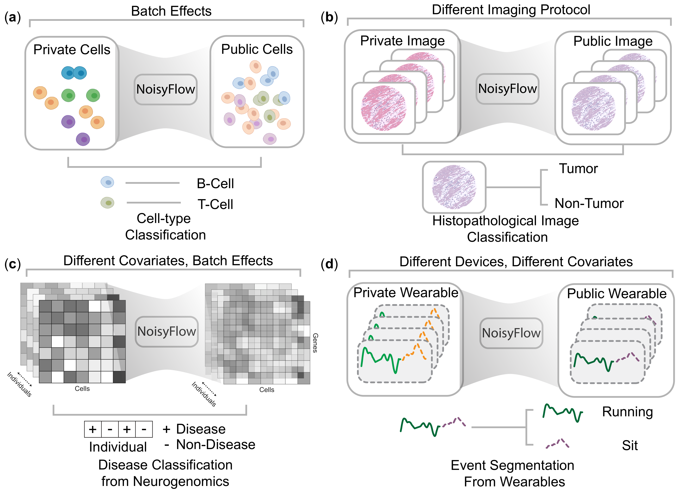

# NoisyFlow: Privacy-Preserving Federated Synthetic Data Generation

[Main schematic](assets/Noisyflow-Mar24th-schematics-updated.pdf) • [Additional schematic](assets/schematics.pdf) • [Documentation](docs/README.md) • [Quick start](#quick-start) • [Citation](#citation)

[](#citation)
[](#requirements)
[](#requirements)
[](#configuration-guide)

NoisyFlow is a three-stage framework for privacy-preserving federated synthetic data generation. It trains client-side flow-matching generators, learns transport maps from source domains to a target domain, and synthesizes target-like samples for downstream classification.

The method targets domain adaptation under data-sharing constraints. Synthetic samples can be used alone or combined with limited target labels, while differential privacy mechanisms control the privacy cost of client-side generator and transport training.

This repository accompanies the ISMB 2026 / *Bioinformatics* version of NoisyFlow.

## Method Overview

<p align="center">
  <a href="assets/Noisyflow-Mar24th-schematics-updated.pdf">
    
  </a>
</p>
<p align="center">
  <em>Figure 1. NoisyFlow pipeline. Clients train DP-enabled flow-matching generators locally. Stage 2 learns ICNN- or flow-matching-based transports that align source domains with the target domain. The server synthesizes target-like data for downstream classifier training and evaluation.</em>
</p>

<p align="center">
  <a href="assets/schematics.pdf">
    
  </a>
</p>
<p align="center">
  <em>Figure 2. Expanded training and evaluation workflow, including client-side generator training, transport fitting, server-side synthesis, and downstream utility/privacy evaluation.</em>
</p>

## Repository Contents

| Path | Purpose |
|---|---|
| `noisyflow/` | Core package for configuration, metrics, utilities, data builders, attacks, and stage implementations. |
| `noisyflow/stage1/` | Client-side flow-matching generators with DP-SGD support. |
| `noisyflow/stage2/` | Transport modules, including ICNN-based transport and flow-matching transport variants. |
| `noisyflow/stage3/` | Server-side synthesis and downstream classifier training. |
| `noisyflow/baselines/` | Baselines for domain adaptation, federated classification, and noise-then-transport comparisons. |
| `configs/publication/` | YAML files for publication experiments. |
| `scripts/` | Data preparation, experiment, plotting, sweep, and benchmarking utilities. |
| `tests/` | Unit tests for configuration, data, metrics, DP, training, and baselines. |
| `docs/` | Detailed documentation for architecture, configuration, data, experiments, and attacks. |
| `assets/` | Schematics and rendered README figures. |
| `run.py` | Main experiment entrypoint. |

## Contents

- [Requirements](#requirements)
- [Installation](#installation)
- [Quick start](#quick-start)
- [Pipeline](#pipeline)
- [Configuration guide](#configuration-guide)
- [Reproducible workflows](#reproducible-workflows)
- [Documentation](#documentation)
- [Tests](#tests)
- [Citation](#citation)

## Requirements

| Component | Version / Expectation |
|---|---|
| OS | Linux recommended; CUDA GPU recommended for nontrivial experiments. |
| Python | 3.10+ recommended. |
| PyTorch | Required for all training and inference paths. |
| PyYAML | Required for YAML configuration files. |
| Opacus | Required dependency; used for DP-SGD in Stage 1 and Stage 2 experiments. |
| Matplotlib | Optional; required for privacy-utility plots. |
| scikit-learn | Optional; required for PCA, standardization, and RandomForest baselines. |

## Installation

Create an environment and install the core dependencies:

```bash
python -m venv .venv
source .venv/bin/activate
pip install -r requirements.txt
```

Dataset-specific extras are documented as commented entries in `requirements.txt`. CAMELYON17-WILDS preparation uses `wilds` and `torchvision`; the BrainSCOPE preparation script uses `pandas`.

## Quick Start

| Phase | Goal | Output |
|---|---|---|
| A) Configure | Select a YAML file and set device/data paths. | Ready-to-run experiment config. |
| B) Run | Launch the pipeline with `run.py`. | Training logs, synthetic samples, and metrics. |
| C) Evaluate | Run privacy-utility sweeps, baselines, or membership inference attacks. | Tables, JSON metrics, and plots. |

Run the default experiment:

```bash
python run.py --config configs/default.yaml
```

Run a compact smoke test:

```bash
python run.py --config configs/quick_smoke.yaml
```

`configs/quick_smoke.yaml` uses `device: cuda` by default. Set `device: cpu` in the YAML file when CUDA is unavailable.

Run the minimal toy example:

```bash
python noisyflow_sketch.py
```

## Pipeline

NoisyFlow is organized into three stages.

1. **Stage 1: private client generators.** Each client trains a flow-matching generator on local data. Training supports both non-private optimization and DP-SGD through Opacus.
2. **Stage 2: target-domain transport.** The pipeline learns source-to-target transport with ICNN-based optimal transport, CellOT-style training, or flow-matching transport variants.
3. **Stage 3: synthesis and classification.** The server samples synthetic target-like data and trains downstream classifiers using synthetic data, limited target labels, or both.

The repository also provides privacy-utility sweeps and membership inference attack evaluations.

## Configuration Guide

Experiments are specified by YAML files and executed by `run.py`.

| Config block | Purpose |
|---|---|
| `seed`, `device` | Reproducibility and CPU/GPU selection. |
| `data` | Dataset type, preprocessing, target/source split, and dataset-specific parameters. |
| `stage1` | Flow-matching generator architecture, optimization, and DP-SGD settings. |
| `stage2` | Transport option, ICNN/CellOT/flow-matching settings, and DP settings. |
| `stage3` | Number of synthetic samples per client and downstream classifier configuration. |
| `privacy_curve` | Privacy-utility sweep settings. |

Supported `data.type` values include:

- synthetic builders: `federated_mixture_gaussians`, `mixture_gaussians`, `toy_federated_gaussians`;
- biological and wearable datasets: `federated_cell_dataset`, `brainscope`, `camelyon17`, `camelyon17_wilds`, `pamap2`;
- CellOT convenience wrappers: `cellot_lupuspatients_kang_hvg`, `cellot_statefate_invitro_hvg`, `cellot_sciplex3_hvg`.

Publication configurations live in `configs/publication/`.

## Reproducible Workflows

Fetch preprocessed CellOT datasets:

```bash
python scripts/fetch_cellot_datasets.py --dataset lupuspatients
python scripts/fetch_cellot_datasets.py --dataset statefate
python scripts/fetch_cellot_datasets.py --dataset sciplex3
```

Prepare the BrainSCOPE-style cohort dataset from processed matrices in `liyy2/aging_YL`:

```bash
python scripts/prepare_brainscope_aging_yl.py
python run.py --config configs/brainscope_excitatory_smoke.yaml
python run.py --config configs/brainscope_excitatory_demo_best.yaml
```

Sweep reference-label and synthetic-sample budgets:

```bash
python scripts/sweep_ref_sweet_spot.py --config configs/brainscope_excitatory_ref50_optionC.yaml \
  --ref-sizes 5,10,20,30,50,75,100,150,all \
  --syn-sizes 100,200,500,1000,2000,5000,all \
  --output-json plots/brainscope_ref_sweep_seed0.json \
  --plot-output plots/brainscope_ref_sweep_seed0.pdf
```

## Documentation

Start with:

| Resource | Purpose |
|---|---|
| `docs/README.md` | Documentation index. |
| `docs/overview.md` | Pipeline overview and stage summary. |
| `docs/configuration.md` | Full configuration reference. |
| `docs/data.md` | Data builders and dataset preparation. |
| `docs/experiments.md` | CLI usage and experiment recipes. |
| `docs/attacks.md` | Membership inference attack details. |
| `docs/architecture.md` | Code map and module relationships. |

## Tests

Run the unit test suite:

```bash
python -m unittest discover -s tests
```

Tests that require plotting, dataset-specific, or baseline-only dependencies are skipped when those packages are not installed.

## Citation

If you use NoisyFlow in your work, please cite the ISMB 2026 / *Bioinformatics* paper. The final BibTeX entry should be added here once proceedings metadata is available.
